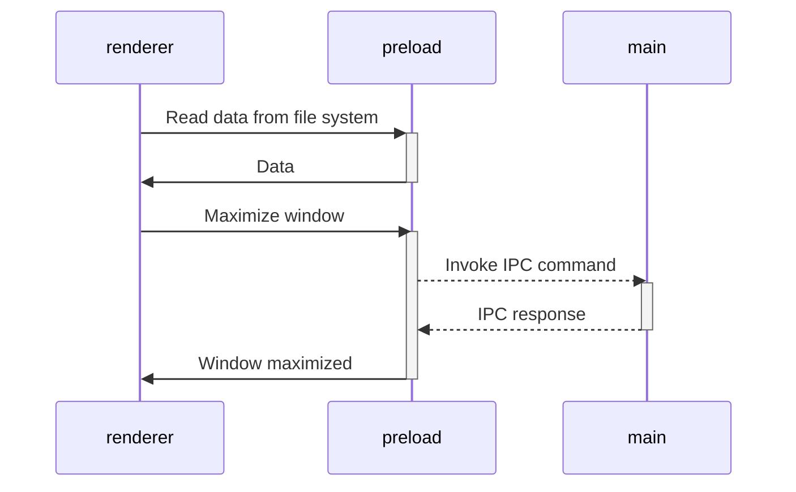

### Automatic tests

- End-to-end are placed in the root [`tests`](tests) directory and use [playwright].
- You may write any unit tests inside each package and use whatever you ~~want~~ need.

### Continuous Integration

- The configured workflow will check the types for each push and PR.
- Code signing supported. See [code-signing documentation](https://www.electron.build/code-signing.html).

### Auto-update

Each time you push changes to the `main` branch,
the [`ci`](.github/workflows/ci.yml) workflow starts to create and deploy a new application version with then will be downloaded and applied by each app instance.

## Project Structure

The project is designed as monorepo where each part of the application is an independent package.
Each package could have own tech stack, tests, dependencies, frameworks, etc.
All internal names are prefixed by `@app/*`.
There are no technical reasons for this.
It's just for you to make it easier to understand the architecture.

Initially, the repository contains only a few packages.4

### Packages with building tools:

- [`packages/integrate-renderer`](packages/integrate-renderer) - A helper package that is not included in the runtime.
  It is used in `npm run init` to configure a new interface package.
- [`packages/electron-versions`](packages/electron-versions) - A set of helper functions to get the versions of internal components bundled within Electron.

### Packages with app logic:

- [`packages/main`](packages/main) - Implementation of Electron's [**main script**](https://www.electronjs.org/docs/tutorial/quick-start#create-the-main-script-file).
- [`packages/preload`](packages/preload) - Implementation of Electron's [**preload scripts**](https://www.electronjs.org/docs/latest/tutorial/tutorial-preload).


## How It works

### Compile executable

When an application is ready to distribute, you need to compile it into executable.
We are using [electron-builder] for
this.

- You can compile application locally by `npm run compile`.
  In this case, you will get executable that you cat share, but it will not support auto-updates out-of-box.
- To have auto-updater, you should compile an application and publish it to one or more supported sources for distribution. In this case, all application instances will download and apply all new updates. This is done by GitHub action in [release.yml](.github/workflows/release.yml).

> [!TIP]
> This template is configured to use GitHub Releases to distribute updates, but you can configure whatever you need.
> Find more in [electron-builder docs](https://www.electron.build/configuration/publish).


All dependencies that require Node.js api can be used in
the [`preload` script](https://www.electronjs.org/docs/latest/tutorial/process-model#preload-scripts).

#### Expose in the main world

Here is an example. Let's say you need to read some data from the file system or database in the renderer.

In the preload context, create a function that reads and returns data. To make the function announced in the preload
available in the render, you usually need to call
the [`electron.contextBridge.exposeInMainWorld`](https://www.electronjs.org/ru/docs/latest/api/context-bridge).

However, this template is designed to use all power of ES modules.
You can import anything from `preload` in `renderer`.
All the data will quietly throw through the `electron.contextBridge.exposeInMainWorld()`,
so you don't need to worry about it.

```ts
// preload/src/index.ts
import {readFile} from 'node:fs/promises';

// Encapsulate types if you use typescript
interface UserData {
  prop: string
}

// Will call `electron.contextBridge.exposeInMainWorld('getUserData', getUserData)`
export function getUserData(): Promise<UserData> {
  return readFile('/path/to/file/in/user/filesystem.json', {encoding: 'utf8'}).then(JSON.parse);
}
```

Now you can import and call the method in renderer

```ts
// renderer/src/anywere/component.ts
import {getUserData} from '@app/preload'

// Method will came from exposed context
// const userData = globalThis['getUserData']
const userData = await getUserData()
```

> [!TIP]
> Find more
> in [Context Isolation tutorial](https://www.electronjs.org/docs/tutorial/context-isolation#security-considerations).

### Working with Electron API

Although the preload has access to all of Node.js API, it **still runs in the BrowserWindow context**, so only limited
electron modules are available in it.

> [!TIP]
> Check the [electron docs](https://www.electronjs.org/ru/docs/latest/api/clipboard) for the full list of available
> methods.

All other electron methods can be invoked in the `main`.

As a result, the architecture of interaction between all modules is as follows:



> [!TIP]
> Find more in [Inter-Process Communication tutorial](https://www.electronjs.org/docs/latest/tutorial/ipc).

### Modes and Environment Variables

All environment variables are set as part of the `import.meta`, so you can access them vie the following
way: `import.meta.env`.

> [!NOTE]
> If you are using TypeScript and want to get code completion,
> you must add all the environment variables to the [`ImportMetaEnv` in `types/env.d.ts`](types/env.d.ts).

The mode option is used to specify the value of `import.meta.env.MODE` and the corresponding environment variables files
that need to be loaded.

By default, there are two modes:

- `production` is used by default
- `development` is used by `npm start` script

When running the build script, the environment variables are loaded from the following files in your project root:

```
.env                # loaded in all cases
.env.local          # loaded in all cases, ignored by git
.env.[mode]         # only loaded in specified env mode
.env.[mode].local   # only loaded in specified env mode, ignored by git
```

> [!WARNING]
> To prevent accidentally leaking env variables to the client, only variables prefixed with `VITE_` are exposed to your
> Vite-processed code.

For example, let's take the following `.env` file:

```
DB_PASSWORD=foobar
VITE_SOME_KEY=123
```

Only `VITE_SOME_KEY` will be exposed as `import.meta.env.VITE_SOME_KEY` to your client source code, but `DB_PASSWORD`
will not.

> [!TIP]
> You can change that prefix or add another. See [`envPrefix`](https://vitejs.dev/config/shared-options.html#envprefix).

### NPM Scripts

```sh
npm start
```
Start application in development more with hot-reload.

---
```sh
npm run build
```
Runs the `build` command in all workspaces if present.

---
```sh
npm run compile
```
First runs the `build` script,
then compiles the project into executable using `electron-builder` with the specified configuration.

---
```sh
npm run compile -- --dir -c.asar=false
```
Same as `npm run compile` but pass to `electron-builder` additional parameters to disable asar archive and installer
creating.
Useful for debugging compiled application.

---
```sh
npm run test
```
Executes end-to-end tests on **compiled app** using Playwright.

---
```sh
npm run typecheck
```
Runs the `typecheck` command in all workspaces if present.

---
```sh
npm run create-renderer
```
Initializes a new Vite project named `renderer`. Basically same as `npm create vite`.

---
```sh
npm run integrate-renderer
```
Starts the integration process of the renderer using the Vite Electron builder.

---
```sh
npm run init
```
Set up the initial environment by creating a new renderer, integrating it, and installing the necessary packages.


[vite]: https://github.com/vitejs/vite/

[electron]: https://github.com/electron/electron

[electron-builder]: https://github.com/electron-userland/electron-builder

[playwright]: https://playwright.dev
